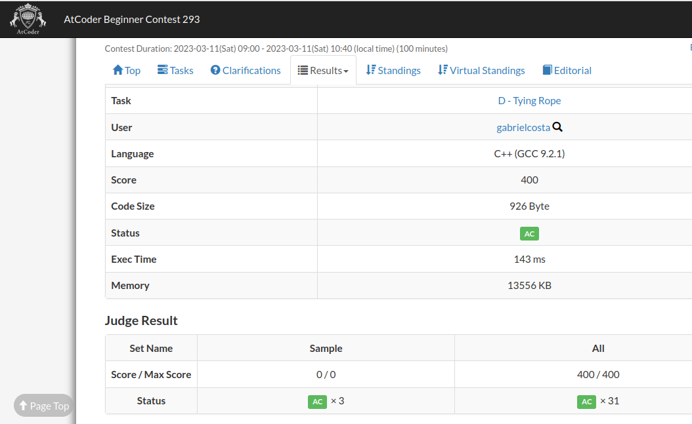
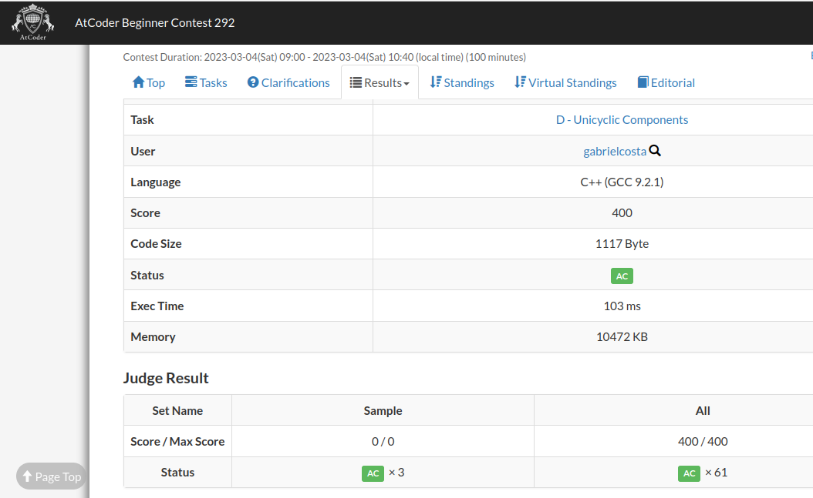
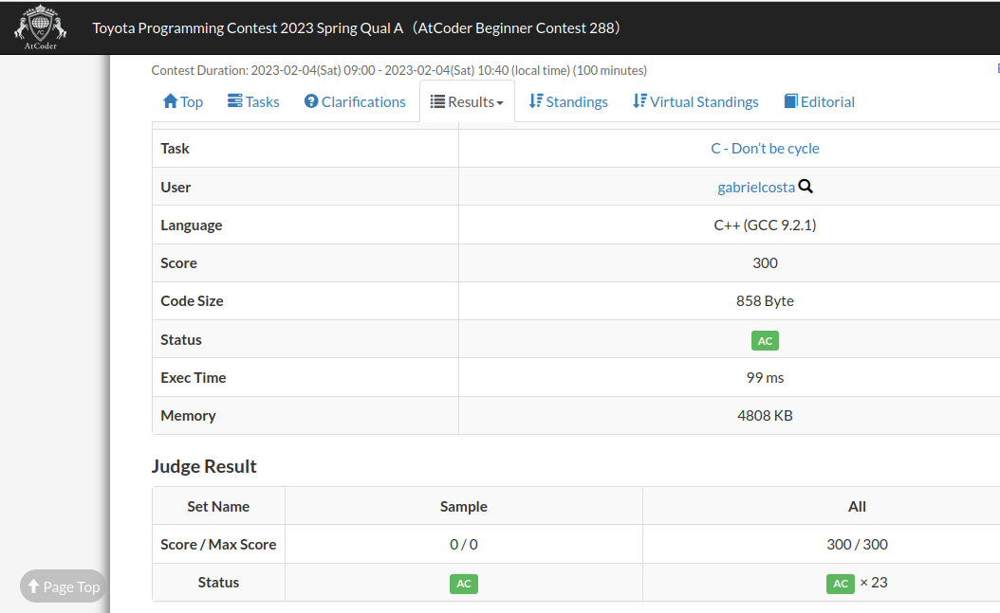

# Grafos2_TyingRopeUFDS

**Número da Lista**: 20 
**Conteúdo da Disciplina**: Grafos 2 

## Alunos
| Matrícula | Aluno |
| -- | -- |
| 19/0045817  | Gabriel Costa de Oliveira      |
| 20/1000379  |  Leonardo Milomes Vitoriano |

## Sobre 
A dupla decidiu realizar 3 exercícios do [AtCoder](https://atcoder.jp/), que é um site de concurso de programação para qualquer pessoa, para praticar o conteúdo de Grafos 2, com foco no algoritmos de Kruskal, ou seja, algoritmo UFDS (Union-Find First Search).

Os enunciados dos 3 exercícios podem ser encontrados na listagem abaixo:

- [Tying Ropes](https://atcoder.jp/contests/abc293/tasks/abc293_d)
- [Unicyclic Components](https://atcoder.jp/contests/abc292/tasks/abc292_d)
- [Don’t be cycle](https://atcoder.jp/contests/abc288/tasks/abc288_c)

## Screenshots

Na figura 1, encontra-se a submissão aceita do exercício Tying Ropes:

Figura 1 - Tying Ropes

Na figura 2, encontra-se a submissão aceita do exercício Unicyclic Components: 

Figura 2 - Unicyclic Components.

Na figura 3, encontra-se a submissão aceita do exercício Don’t be cycle: 

Figura 3 - Don’t be cycle.

## Instalação 

**Linguagem**: C++ 

É necessário ter pré-instalados e configurados na sua máquina:
- [gcc](https://gcc.gnu.org/);

No **Linux**, para instalar o **g++**, execute o seguinte comando:

    sudo apt-get install build-essential

## Uso 

Após instalar as dependências do projeto, realize os seguintes comandos: 

    git clone https://github.com/projeto-de-algoritmos/Grafos2_TyingRopeUFDS
    cd Grafos2_TyingRopeUFDS

Agora o seu ambiente agora está configurado. Entre na pasta no qual deseje testar um exercícios dentre os 3 disponibilizidos. Basta entrar na pasta do exercício e digitar os comandos:

    cd <nomePasta>
    g++ <nomeArquivo>.cpp
    ./a.out < test1.txt
    ./a.out < test2.txt
    ./a.out < test3.txt

Pronto! O código está rodando e os exercícios podem ser testados.

## Vídeo

O vídeo explicando o algoritmo e o funcionamento dele, pode ser encontrado no link a seguir:
- [Vídeo](assets/videoGrafos2.mp4)

